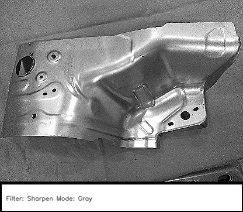

# Industrial Component Defect Analysis  

Classification of a specific automotive component called **Fender Apron** (shown below) as defective or non-defective using Transfer Learning, achieving an f-1 score of 1.00.  

#### Contents
* `functions.py` contains functions for preprocessing of images and making classes 
* `Machine defect detection.ipynb` is for code walk-through  
* `routes.py` is the Flask API file
* index.html`, the frontend of the application
* 
#### Sample processed image of Fender Apron

### Dataset
The data is already labelled having a total of 250 images with 139 images as healthy machine parts and rest 111 as defective parts. Images given in the dataset were captured from different angles and scales. Training and Test datasets were prepared by randomly selecting a total of 25 images (i.e. 10%) in which 10 were defective and 15 were healthy parts. Training/validation split used is 90/10. 

## Approaches:
The initial approach was to apply object localization and image cropping for all of the images to increase consistency i.e. to locate the machine part first and then the defects. The issue with this approach was that with computer Vision, It would require to rewriting our code to find our regions of interests whenever there are changes in product types. 
 Another approach, to make it easier for the model to learn how to differentiate between the defective and healthy parts, by feeding in processed images with convolution kernels. But these approaches would have made the model weaker in the sense that in those cases it would need only object- localized and specially processed images to give accurate results. 

### Deep Learning Architectures:
As we are having insufficiency for training data (just 250 images) for applying deep learning so I have employed transfer learning to mitigate that problem.
1)	**Convolutional neural network (CNN)** as the baseline model: 3 Conv2D/MaxPooling2D pairs as the feature extractor and 3 Dense layers as the classifier.
Transfer Learning Models
2)	**InceptionV3**: [Keras Application InceptionV3](https://keras.io/applications/#mobilenet) fine-tuning the classifier by using 1 GlobalAveragePooling2D layer and 2 Dense layers.
3)	**MobileNet**: [Keras Application MobileNet](https://keras.io/applications/#inceptionv3) fine-tuning the classifier by using 1 GlobalAveragePooling2D layer and 2 Dense layers
